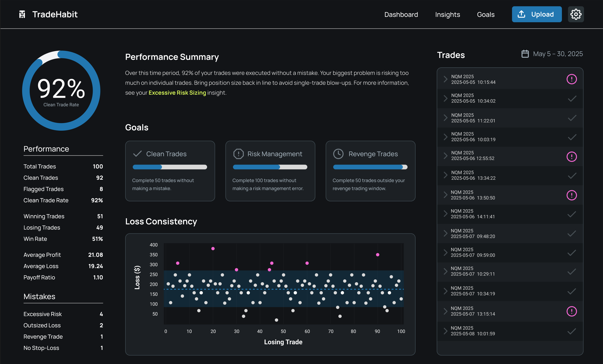

# TradeHabit - Behavioral Analytics for Novice Traders


## Overview

TradeHabit is a Python-based tool designed to analyze trader order data to identify and quantify common trading mistakes or suboptimal behaviors. The initial focus is on parsing and analyzing order execution reports, starting with data exported from NinjaTrader (in CSV format).

The primary goal is to help traders gain insights into their patterns and improve their trading discipline by highlighting recurring mistakes.

## Current Features

*   **NinjaTrader CSV Parsing:** Loads and processes order data from CSV files exported by NinjaTrader.
*   **Trade Identification:** Reconstructs individual trades from a stream of order execution events, handling entries, exits, and scaling-in.
*   **Mistake Detection: "No Stop-Loss Order"**
    *   Analyzes each identified trade to determine if a protective stop-loss order was appropriately placed and managed throughout the trade's lifecycle.
    *   Considers various scenarios, including:
        *   Stops placed before or during the trade.
        *   Stops filled to exit the trade (even if at breakeven or for a small profit).
        *   Stops canceled as part of an OCO (One-Cancels-Other) with a profit target.
        *   Stops actively maintained during the trade.

## Technology Stack

*   Python 3.x
*   Pandas: For data manipulation and analysis.

## Project Structure

```
tradehabit/
├── analytics/                # Core mistake analysis logic
│   ├── tests/                # Unit tests for analytics
│   └── stop_loss_analyzer.py # Logic for "No Stop-Loss Order"
├── models/                   # Data models (e.g., Trade dataclass)
│   └── trade.py
├── parsing/                  # Data loading, normalization, and trade counting
│   ├── tests/                # Unit tests for parsing utilities
│   ├── utils.py              # Timestamp normalization and other utilities
│   └── trade_counter.py      # Loads CSVs, identifies trades
├── tasks/                    # Project planning documents (PRDs, task lists)
├── run_analyzer_sample.py    # Main script to run the analysis
└── README.md                 # This file
```

## Setup

1.  **Clone the repository:**
    ```bash
    git clone https://github.com/terrybvaughn/tradehabit.git
    cd tradehabit
    ```
2.  **Ensure Python and Pandas are installed.** If you are using a virtual environment (recommended):
    ```bash
    python -m venv venv
    source venv/bin/activate  # On Windows: venv\Scripts\activate
    pip install pandas
    ```
    (You might want to create a `requirements.txt` file later for easier dependency management.)

## Usage

To analyze your NinjaTrader order CSV data:

1.  Ensure your CSV file is accessible.
2.  Run the `run_analyzer_sample.py` script from the project root, providing the path to your CSV file as an argument:

    ```bash
    python run_analyzer_sample.py /path/to/your/ninjatrader_orders.csv
    ```

The script will output:
*   The total number of trades found.
*   Details of any trades flagged with the "no stop-loss order" mistake.
*   A summary of the total mistakes found.

## Future Enhancements (Examples)

*   Detection of other common trading mistakes.
*   Loss dispersion analysis.
*   Analytics dashboard for behavioral analytics visualization.
*   Support for other broker export formats.
*   Basic reporting or visualization of mistake patterns.

--- 
