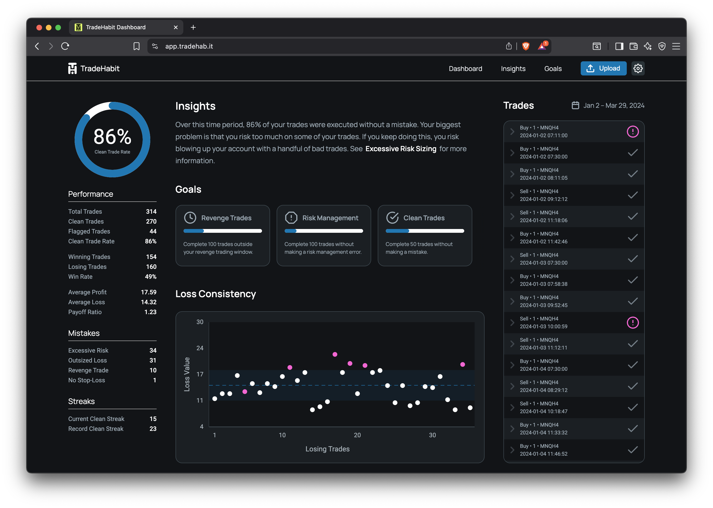

# TradeHabit - Behavioral Analytics for Novice Traders


## 🚀 Live Application

**Try TradeHabit now**: [app.tradehab.it](https://app.tradehab.it)  
Use the demo data link if you don't have your own NinjaTrader CSV files.

## Overview

TradeHabit is a **prototype** behavioral analytics platform that helps novice traders identify and fix bad trading habits. Currently in development, the application combines a Python-based backend for sophisticated data analysis with a modern React frontend for interactive visualization. It analyzes trader order data to identify and quantify common trading mistakes, starting with data exported from NinjaTrader (in CSV format).

**Current Status**: Prototype - not a commercial software application. Designed for demonstration and research purposes.

## Current Features

* **NinjaTrader CSV Parsing**  
  Loads and normalizes order data from NinjaTrader-exported CSVs (timestamps, side, price, qty, order IDs, etc.).

* **Trade Identification**  
  Rebuilds discrete trades from the event stream—handles new entries, partial exits, scale-ins, and full exits to yield a list of completed `Trade` objects.

* **Points Won-Lost Calculation**  
  Computes each trade's points won or lost per contract.

* **Comprehensive Mistake Detection Framework**  
  All trades are passed through a suite of analyzers that identify common trading mistakes:
  1. **Stop-Loss Analysis**  
     - Flags trades without protective stops
     - Tracks stop-loss placement timing and effectiveness
     - Handles OCO (One-Cancels-Other) order scenarios
  2. **Excessive Risk Analysis**  
     - Identifies trades with position sizes exceeding statistical risk parameters
     - Monitors risk-to-reward ratios using configurable sigma multipliers
  3. **Outsized Loss Analysis**  
     - Marks losses exceeding μ + σ·(user σ-multiplier) on your points-lost distribution
     - Provides statistical context for loss severity
  4. **Revenge Trade Analysis**  
     - Identifies trades entered "too soon" after a loss (configurable window based on median hold time)
     - Analyzes emotional trading patterns and their impact on performance
  5. **Risk Sizing Consistency Analysis**  
     - Evaluates position sizing consistency using coefficient of variation
     - Tracks risk exposure patterns across different market conditions

* **Interactive Frontend Dashboard**  
  Modern React-based interface with:
  - Real-time data visualization and charts
  - Goal tracking with streak analysis
  - Interactive insights and behavioral recommendations
  - Responsive design for desktop and mobile

* **Behavioral Insights Engine**  
  `/api/insights` provides comprehensive behavioral analytics:
  - Prioritized diagnostic insights using decision-tree logic
  - Summary diagnostics for each mistake category
  - Trend analysis of trading behavior
  - Actionable improvement suggestions with statistical backing
  - Performance metrics by mistake type

* **Advanced Goal Tracking System**  
  `/api/goals` and `/api/goals/calculate` support:
  - Predefined behavioral goals (Clean Trades, Risk Management, Revenge Trading)
  - Custom user-defined goals with flexible parameters
  - Streak tracking by trades or calendar days
  - Progress monitoring with percentage completion
  - Date-filtered goal evaluation

* **Comprehensive Analytics Endpoints**  
  - **Trade Summary** (`/api/summary`): Overall performance metrics, streaks, payoff ratios
  - **Trade Details** (`/api/trades`): Complete trade list with metadata and date ranges
  - **Loss Analysis** (`/api/losses`): Statistical loss distribution with outlier detection
  - **Revenge Trading** (`/api/revenge`): Detailed revenge trade performance analysis
  - **Risk Sizing** (`/api/risk-sizing`): Position sizing consistency metrics
  - **Excessive Risk** (`/api/excessive-risk`): Statistical risk exposure analysis
  - **Stop-Loss Summary** (`/api/stop-loss`): Stop-loss usage and effectiveness
  - **Win Rate & Payoff** (`/api/winrate-payoff`): Performance ratio analysis

* **Dynamic Threshold Configuration**  
  `/api/settings` allows real-time adjustment of analysis parameters:
  - Sigma multipliers for outsized loss and excessive risk detection
  - Revenge trade window multipliers
  - Risk sizing variation thresholds
  - Settings persist across analysis sessions

* **Production-Ready Architecture**  
  - Comprehensive error handling with JSON error responses
  - CORS configuration for multiple frontend origins
  - File upload validation (size, format)
  - Health check endpoint for deployment monitoring
  - Gunicorn WSGI server configuration

All analytics live behind a Flask REST API with query-parameter overrides, enabling the frontend to drive behavioral analysis dynamically.

## Technology Stack

### Backend
*   **Python 3.10+** with Flask web framework
*   **Pandas & NumPy** for data manipulation and statistical analysis
*   **Flask-CORS** for cross-origin resource sharing
*   **Werkzeug** for WSGI utilities and development server
*   **Python-dateutil** for advanced datetime handling
*   **Gunicorn** for production WSGI deployment

### Frontend
*   **React 19** with TypeScript for type-safe development
*   **Zustand** for global state management
*   **TanStack Query** for efficient server state management
*   **Modern CSS Modules** for component-scoped styling
*   **Interactive data visualization** components

### Deployment
*   **Backend**: Deployed on Replit with auto-scaling
*   **Frontend**: Available at [app.tradehab.it](https://app.tradehab.it)
*   **Frontend Repository**: [tradehabit-frontend](https://github.com/terrybvaughn/tradehabit-frontend)

## Project Structure

```
tradehabit-backend/
├── app.py                          # Flask entry point with 14 API endpoints
├── analytics/                      # Behavioral analysis modules
│   ├── goal_tracker.py            # Goal progress and streak analysis
│   ├── stop_loss_analyzer.py      # Stop-loss detection and analysis
│   ├── excessive_risk_analyzer.py # Statistical risk exposure analysis
│   ├── outsized_loss_analyzer.py  # μ+σ "Outsized Loss" detection
│   ├── revenge_analyzer.py        # Revenge-trade detection and analysis
│   ├── risk_sizing_analyzer.py    # Position sizing consistency analysis
│   ├── winrate_payoff_analyzer.py # Win rate and payoff ratio analysis
│   ├── mistake_analyzer.py        # Orchestrates all mistake detectors
│   ├── insights.py               # Prioritized insight generation
│   └── trade_counter.py           # Trade reconstruction from order events
├── parsing/                        # Data ingestion and processing
│   ├── order_loader.py            # CSV loading with validation
│   ├── utils.py                   # Timestamp normalization utilities
│   └── __main__.py                # Command-line interface
├── models/                         # Data models
│   └── trade.py                   # Enhanced Trade dataclass with metrics
├── errors.py                       # Centralized error handling
├── requirements.txt               # Python dependencies
├── Procfile                       # Production deployment configuration
├── data/                          # Sample and test data files
├── images/                        # Documentation and mockup assets
├── tasks/                         # Project documentation and PRDs
└── README.md                      # This file
```

## Current Limitations

As a prototype application, TradeHabit has several current limitations:

* **NinjaTrader-only support**: Currently only supports CSV exports from NinjaTrader
* **No data persistence**: No database or user history - data uploaded per session
* **Session-based analysis**: Data is lost when the application restarts
* **Single-user design**: No account creation or user authentication
* **Limited analytics depth**: Focused feature set for behavioral analysis demonstration

## Setup

### Prerequisites
* **Python 3.10+**: Required for modern type hints and dataclass features
* **pip**: Python package manager
* **Virtual Environment**: Recommended for dependency isolation

1.  **Clone the repository:**
    ```bash
    git clone https://github.com/terrybvaughn/tradehabit-backend.git
    cd tradehabit-backend
    ```

2.  **Set up your environment** (virtual environment recommended):
    ```bash
    python -m venv venv
    source venv/bin/activate  # On Windows: venv\Scripts\activate
    pip install -r requirements.txt
    ```

3.  **Start the development server:**
    ```bash
    python app.py
    ```
    By default, the service listens on `http://localhost:5000`.

## API Reference

TradeHabit provides a RESTful API with **14 endpoints** for behavioral trading analysis. All endpoints return JSON responses with consistent error handling and CORS support.

### Core Analysis

**POST `/api/analyze`** - Upload and analyze NinjaTrader CSV data
```bash
curl -X POST "http://localhost:5000/api/analyze?sigma=1.0" \
  -F "file=@/path/to/your_ninjatrader_data.csv"
```

**GET `/api/summary`** - High-level dashboard summary with streaks and diagnostics
```bash
curl http://localhost:5000/api/summary
```

**GET `/api/insights`** - Comprehensive behavioral analysis with prioritized recommendations
```bash
curl http://localhost:5000/api/insights
```

### Detailed Analytics

**GET `/api/trades`** - Complete trade list with metadata
```bash
curl http://localhost:5000/api/trades
```

**GET `/api/losses`** - Loss-dispersion analysis with statistical outlier detection
```bash
curl "http://localhost:5000/api/losses?sigma=1.0&symbol=MNQH5"
```

**GET `/api/revenge`** - Revenge trading analysis with configurable detection window
```bash
curl "http://localhost:5000/api/revenge?k=1.0"
```

**GET `/api/risk-sizing`** - Position sizing consistency analysis
```bash
curl "http://localhost:5000/api/risk-sizing?vr=0.35"
```

**GET `/api/excessive-risk`** - Statistical risk exposure analysis
```bash
curl "http://localhost:5000/api/excessive-risk?sigma=1.5"
```

**GET `/api/stop-loss`** - Stop-loss usage and effectiveness summary
```bash
curl http://localhost:5000/api/stop-loss
```

**GET `/api/winrate-payoff`** - Win rate and payoff ratio analysis
```bash
curl http://localhost:5000/api/winrate-payoff
```

### Goal Tracking

**GET `/api/goals`** - Predefined goal progress (Clean Trades, Risk Management, etc.)
```bash
curl http://localhost:5000/api/goals
```

**POST `/api/goals/calculate`** - Calculate custom goal progress
```bash
curl -X POST http://localhost:5000/api/goals/calculate \
  -H "Content-Type: application/json" \
  -d '[{"id":"custom1","title":"Clean 20 Trades","target":20,"mistake_types":[]}]'
```

### Configuration

**GET/POST `/api/settings`** - Read or update analysis thresholds
```bash
# Get current settings
curl http://localhost:5000/api/settings

# Update thresholds
curl -X POST http://localhost:5000/api/settings \
  -H "Content-Type: application/json" \
  -d '{"sigma_loss":1.2,"k":1.5}'
```

**GET `/api/health`** - System health check
```bash
curl http://localhost:5000/api/health
```

### Query Parameters

Most endpoints support optional query parameters for customization:
- `sigma` - σ-multiplier for outsized-loss threshold (default: 1.0)
- `sigma_risk` - σ-multiplier for excessive-risk threshold (default: 1.5)  
- `k` - Revenge-window multiplier on median hold time (default: 1.0)
- `vr` - Coefficient-of-variation cutoff for risk-sizing (default: 0.35)
- `symbol` - Filter analysis to specific instrument

## Error Handling

### Standard Error Response Format
All API endpoints return consistent JSON error responses:

```json
{
  "status": "ERROR",
  "message": "Descriptive error message",
  "details": ["Additional error details"]
}
```

### Common Error Codes

#### **400 Bad Request**
- No file part in request
- Invalid file format (must be CSV)
- File size exceeds 2MB limit
- Missing required columns in CSV
- No trades analyzed yet
- Invalid JSON in request body

#### **500 Internal Server Error**
- CSV parsing error
- Data processing failure
- Unexpected server error

### Error Examples

#### File Validation Error
```json
{
  "status": "ERROR",
  "message": "This file is missing required columns:\nMissing columns: Fill Time, B/S",
  "details": []
}
```

#### Data Processing Error
```json
{
  "status": "ERROR",
  "message": "This CSV format is not recognized.",
  "details": []
}
```

#### State Validation Error
```json
{
  "status": "ERROR",
  "message": "No trades have been analyzed yet",
  "details": []
}
```

### Error Handling Features
- **Centralized Error Handling**: `errors.py` provides consistent JSON error responses
- **Validation Layers**: File validation (size, format), data schema validation, statistical calculation error handling
- **User-Friendly Messages**: Maps internal column names to original CSV headers, provides specific missing column information
- **Graceful Degradation**: Handles malformed data without crashing

## Development vs Production

### **Development Environment**
- **Local Setup**: Flask development server with debug mode
- **Hot Reload**: Automatic restart on code changes
- **Debug Output**: Detailed error messages and stack traces
- **CORS Origins**: Includes local development servers (localhost:5173)

### **Production Environment**
- **Deployment**: Backend hosted on Replit with auto-scaling
- **WSGI Server**: Gunicorn for production-grade request handling
- **Frontend**: Deployed separately at [app.tradehab.it](https://app.tradehab.it)
- **Error Handling**: Graceful error responses without sensitive information exposure
- **CORS Configuration**: Restricted to production frontend origins

### **Architecture**
The application follows a **three-tier architecture**:
1. **Presentation Layer**: React frontend (separate repository)
2. **Business Logic Layer**: Flask API with behavioral analysis modules  
3. **Data Layer**: In-memory data processing with CSV file uploads

## Frontend Integration

The complete TradeHabit experience includes a modern React frontend:
- **Repository**: [tradehabit-frontend](https://github.com/terrybvaughn/tradehabit-frontend)
- **Live Application**: [app.tradehab.it](https://app.tradehab.it)
- **Technology**: React 19, TypeScript, Zustand, TanStack Query
- **Features**: Interactive charts, goal tracking, real-time insights

## License

This project is licensed under the **Creative Commons Attribution-NonCommercial-ShareAlike 4.0 International License**.

**You are free to:**
- **Share** — copy and redistribute the material in any medium or format
- **Adapt** — remix, transform, and build upon the material

**Under the following terms:**
- **Attribution** — You must give appropriate credit, provide a link to the license, and indicate if changes were made
- **NonCommercial** — You may not use the material for commercial purposes
- **ShareAlike** — If you remix, transform, or build upon the material, you must distribute your contributions under the same license

See the [LICENSE](LICENSE) file for full details or visit [Creative Commons](https://creativecommons.org/licenses/by-nc-sa/4.0/) for more information.
